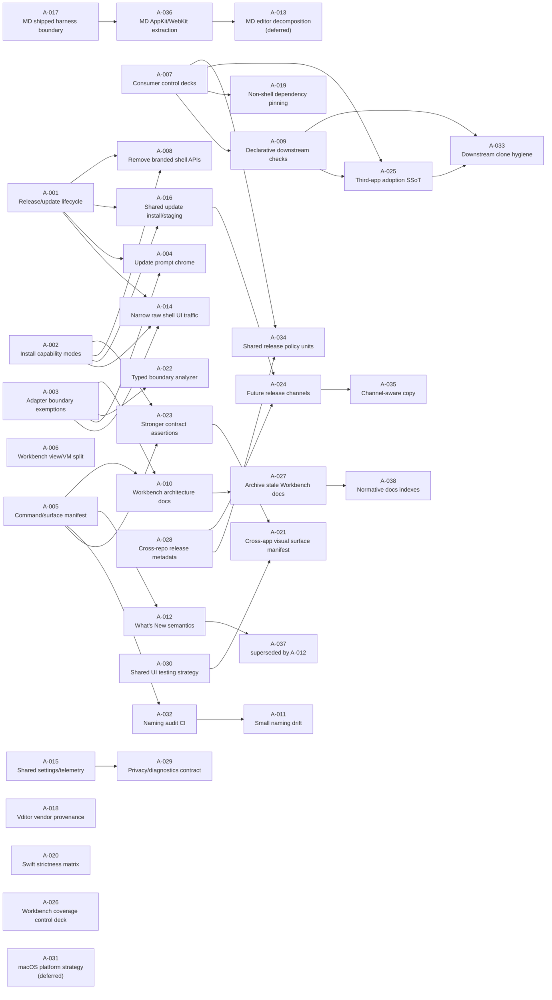

# Shared Shell Split PERT Chart

This PERT chart converts `audit-backlog.md` into a dependency graph and rough
execution model. Estimates are in PR-sized work units, not calendar days:

- O = optimistic PR units
- M = most likely PR units
- P = pessimistic PR units
- E = expected units = `(O + 4M + P) / 6`

The chart intentionally treats `planner-required` items as planning/execution
tranches. `inch-worm-ready-after-reeval` items stay downstream of their
structural dependencies unless they are truly independent cleanup.

## Graph

## PERT Table

| ID | Work item | Lane | Depends on | O | M | P | E |
| --- | --- | --- | --- | ---: | ---: | ---: | ---: |
| A-001 | Release/update lifecycle presentation | planner | - | 2 | 4 | 7 | 4.2 |
| A-002 | Install capability modes | planner | - | 1 | 2 | 4 | 2.2 |
| A-003 | Adapter boundary exemptions | planner | - | 1 | 2 | 4 | 2.2 |
| A-004 | Update prompt chrome decision/primitive | planner | A-001, A-003 | 1 | 2 | 4 | 2.2 |
| A-005 | Consumer command/surface manifest | planner | - | 2 | 4 | 7 | 4.2 |
| A-006 | Workbench view/view-model decomposition | planner | - | 4 | 8 | 14 | 8.3 |
| A-007 | Shell consumer control decks | planner | - | 3 | 5 | 9 | 5.3 |
| A-008 | Remove branded shell APIs | inch-worm after re-eval | A-001, A-002 | 0.5 | 1 | 2 | 1.1 |
| A-009 | Declarative downstream checks | inch-worm after re-eval | A-007 | 1 | 2 | 4 | 2.2 |
| A-010 | Workbench architecture docs | inch-worm after re-eval | A-003, A-005 | 0.5 | 1 | 2 | 1.1 |
| A-011 | Small naming/comment drift | inch-worm after re-eval | A-032 | 0.5 | 1 | 1.5 | 1.0 |
| A-012 | What's New semantics | inch-worm after re-eval | A-005 | 0.5 | 1 | 2 | 1.1 |
| A-013 | MD core editor decomposition radar | defer | A-036 | - | - | - | - |
| A-014 | Narrow raw shell UI type traffic | planner | A-001, A-002, A-003 | 2 | 4 | 8 | 4.3 |
| A-015 | Shared settings/telemetry roadmap | planner | - | 2 | 3 | 6 | 3.3 |
| A-016 | Shared update staging/install primitives | planner | A-001, A-002 | 3 | 6 | 10 | 6.2 |
| A-017 | Ouro MD shipped harness boundary | planner | - | 1 | 2 | 4 | 2.2 |
| A-018 | Vditor vendor provenance | planner | - | 1 | 2 | 4 | 2.2 |
| A-019 | Non-shell dependency pinning policy | inch-worm after re-eval | A-007 | 0.5 | 1 | 3 | 1.3 |
| A-020 | Swift strictness matrix | planner | - | 1 | 2 | 5 | 2.3 |
| A-021 | Cross-app visual surface manifest | planner | A-023, A-030 | 2 | 4 | 7 | 4.2 |
| A-022 | Typed boundary analyzer | planner | A-003 | 2 | 4 | 8 | 4.3 |
| A-023 | Stronger consumer contract assertions | planner | A-002, A-005 | 2 | 3 | 6 | 3.3 |
| A-024 | Future signed/notarized/App Store channels | planner | A-016, A-028 | 2 | 4 | 8 | 4.3 |
| A-025 | Third-app adoption single source of truth | planner | A-007, A-009 | 2 | 4 | 8 | 4.3 |
| A-026 | Workbench coverage/digest control deck | planner | - | 2 | 3 | 6 | 3.3 |
| A-027 | Archive/index stale Workbench docs | inch-worm after re-eval | A-010 | 0.5 | 1 | 3 | 1.3 |
| A-028 | Cross-repo release metadata model | planner | - | 2 | 4 | 7 | 4.2 |
| A-029 | Privacy/diagnostics contract | planner | A-015 | 1 | 3 | 6 | 3.2 |
| A-030 | Shared UI testing strategy | planner | - | 1 | 2 | 4 | 2.2 |
| A-031 | macOS platform strategy | defer | - | - | - | - | - |
| A-032 | Public surface naming audit CI | planner | A-005 | 1 | 2 | 4 | 2.2 |
| A-033 | Downstream clone hygiene | inch-worm after re-eval | A-009, A-025 | 0.5 | 1 | 2 | 1.1 |
| A-034 | Shared release-policy units | planner | A-007, A-028 | 2 | 4 | 8 | 4.3 |
| A-035 | Channel-aware "Direct download" copy | inch-worm after re-eval | A-024 | 0.5 | 1 | 2 | 1.1 |
| A-036 | Ouro MD AppKit/WebKit extraction plan | planner | A-017 | 2 | 4 | 8 | 4.3 |
| A-037 | Superseded What's New split | superseded | A-012 | - | - | - | - |
| A-038 | Cross-repo normative docs indexes | inch-worm after re-eval | A-010, A-027 | 0.5 | 1 | 2 | 1.1 |

## Critical Path Candidates

These are the chains most likely to govern the total campaign, assuming work is
done serially inside each chain but chains can run in parallel.

| Chain | Items | Expected units | Why it matters |
| --- | --- | ---: | --- |
| Release/update channel spine | A-001 -> A-016 -> A-024 -> A-035 | 15.7 | Unifies the riskiest shared shell behavior and keeps future signing/App Store paths from being bolted on later. |
| Control-deck/adoption spine | A-007 -> A-009 -> A-025 -> A-033 | 12.9 | Makes the third-app path obvious and turns shell adoption from scripts+memory into one declared control surface. |
| Command/surface truth spine | A-005 -> A-032 -> A-011 | 7.4 | Prevents public naming and shortcut drift from creeping back after the command manifest exists. |
| Boundary-hardening spine | A-003 -> A-022 | 6.5 | Replaces broad textual guardrails with analyzable ownership boundaries. |
| Docs hygiene spine | A-003 + A-005 -> A-010 -> A-027 -> A-038 | 7.7 after prerequisites | Makes future audits cheaper by separating normative docs from historical planning artifacts. |
| Ouro MD harness/extraction spine | A-017 -> A-036 -> A-013 | 6.5 plus deferred follow-up | Clarifies what ships in the app and creates the next testable extraction surface. |

The longest expected chain is the release/update channel spine. The biggest
single independent item is A-006; it should run as its own Workbench campaign in
parallel with shell/control-deck work instead of blocking the shared shell
spines.

## Recommended Execution Waves

### Wave 1: Architecture Decisions

Run these as planner/doer tranches first:

- A-001, A-002, A-003, A-005, A-007, A-015, A-017, A-020, A-026, A-028, A-030

Parallel-safe groups:

- Release/update: A-001, A-002
- Boundary/surfaces: A-003, A-005
- Control deck: A-007
- Policy/supporting docs: A-015, A-017, A-020, A-026, A-028, A-030

### Wave 2: Structural Follow-Through

Start once Wave 1 decisions are real:

- A-004, A-014, A-016, A-022, A-023, A-024, A-025, A-029, A-032, A-034, A-036

### Wave 3: Re-evaluate And Inch-Worm

After Wave 2 lands, re-read the backlog before touching small items:

- A-008, A-009, A-010, A-011, A-012, A-019, A-027, A-033, A-035, A-038

### Deferred/Superseded

- A-013 stays deferred until the Ouro MD extraction plan proves what the next
  editor-core split should be.
- A-031 stays deferred until a shell feature or third app forces a platform-floor
  decision.
- A-037 is superseded by A-012 and should not be executed separately.

